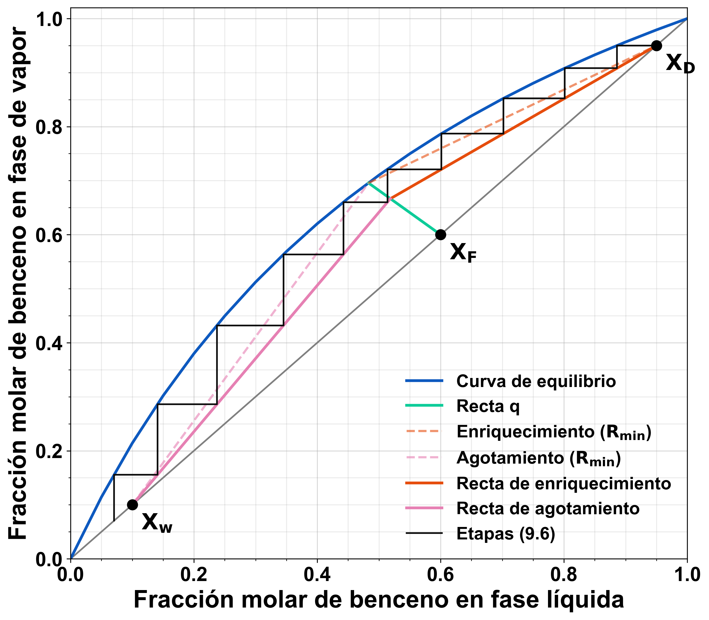

# McCabeThiele
McCabe Thiele Method for Distillation Process

## Data
`Destilacion.csv` holds benzene–toluene vapor–liquid equilibrium data (`X`, `Y`).
It is generated from a constant relative volatility model,
y = αx / (1 + (α − 1)x) with α = 2.45, not from experimental measurements.

## Output
With x_F = 0.6, x_D = 0.95, x_w = 0.1, q = 0.45 and R = 1.6 R_min:

| Result | Value |
|---|---|
| Minimum reflux ratio R_min | 1.20 |
| Operating reflux ratio R | 1.92 |
| Theoretical stages | 9.58 |
| Optimal feed stage | 5 |
| Minimum stages at total reflux | 5.82 |

The figure is saved as PDF, PNG and SVG.

# Author 
Bryan Piguave 
