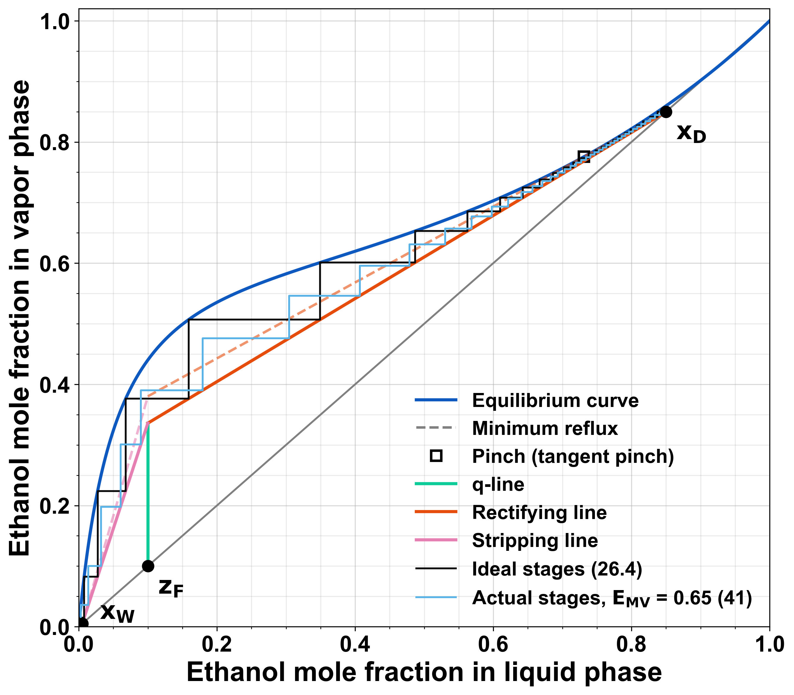
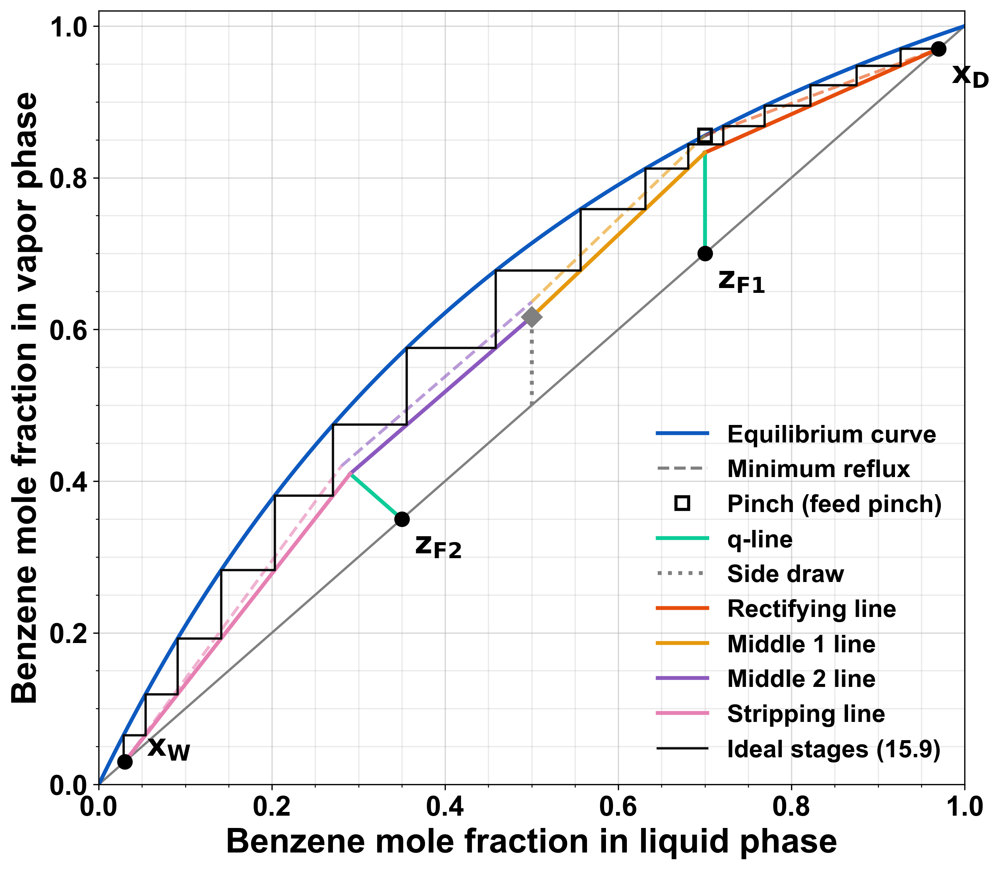
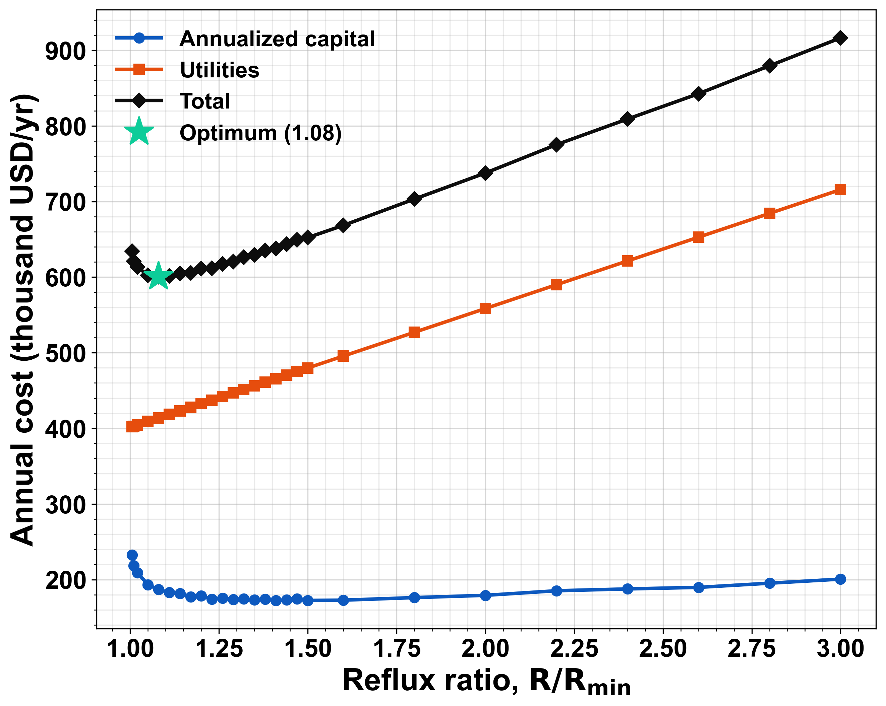
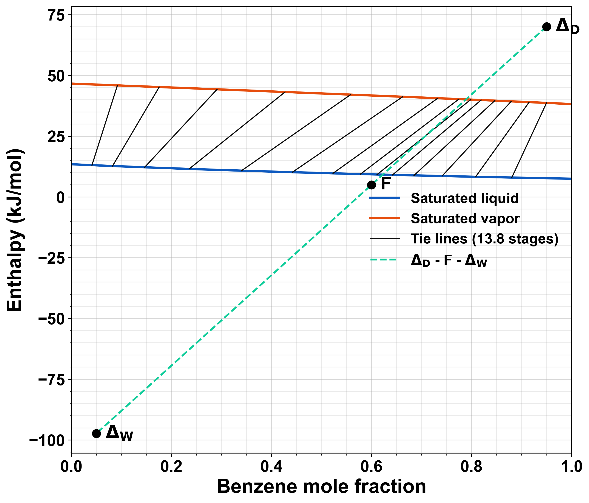

# McCabe–Thiele Distillation Design

A Python toolkit for preliminary design of binary distillation columns. It
starts from the McCabe–Thiele method. It also computes mass and energy
balances, real tray counts, rigorous minimum reflux (including tangent
pinches), shortcut cross-checks, rating of existing columns, a Ponchon–Savarit
energy-balance check, and a cost estimate that finds the optimum reflux ratio.



## Features

**Design results**
- Mass balances: distillate and bottoms rates, and L and V in every section.
- Condenser and reboiler duties (kW), from latent heats corrected with Watson's equation.
- Real trays, from a Murphree vapor efficiency (stepped against the pseudo-equilibrium curve) or an overall efficiency (a number, or the O'Connell correlation).
- Total or partial condenser. A partial condenser and a partial reboiler each count as an equilibrium stage.
- Stage-by-stage table (x, y, y\*, T, L, V), exported to CSV and Excel.

**Thermodynamics**
- VLE from modified Raoult's law at any pressure, with an ideal, Margules, Van Laar, Wilson or NRTL activity model. A constant relative volatility or a CSV table also works.
- Built-in data for benzene, toluene, ethanol, water, methanol, n-hexane and n-heptane, plus Van Laar and Margules parameters for ethanol–water and methanol–water.
- Bubble- and dew-point temperatures, and a temperature profile along the column.
- Feed condition from its temperature (subcooled, two-phase or superheated), or q given directly.
- Azeotrope detection. The design stops if an azeotrope lies between the products.

**Minimum reflux and cross-checks**
- R_min is the smallest reflux at which no operating line touches the equilibrium curve. This finds tangent pinches (for example ethanol–water) as well as feed pinches. It also works with several feeds, side draws and direct steam.
- Fenske–Underwood–Gilliland shortcut and Kirkbride feed location, next to the graphical result.
- Stages against R/R_min, and stages against feed location.

**Economics**
- Column diameter (Souders–Brown flooding) and height; exchanger areas.
- Installed costs from Guthrie/Douglas correlations, plus steam and cooling-water costs.
- Total annual cost against R/R_min, with the optimum reflux ratio marked.

**Other column types**
- Rating an existing column: given its stages, feed stage, R and D, find the x_D and x_W it reaches.
- Several feeds, and liquid or vapor side draws.
- Direct (live) steam in place of a reboiler.
- Stripping-only and rectifying-only columns.
- Ponchon–Savarit enthalpy–composition method, which drops the constant-molar-overflow assumption.

**Interfaces**
- YAML/JSON design cases with command-line overrides.
- A Streamlit app with sliders.
- Python API and a pytest suite.

## Installation

```bash
pip install -r requirements.txt
# or, to get the `mccabe-thiele` command:
pip install -e ".[app,test]"
```

Requires Python 3.9+.

## Usage

### Command line

```bash
python -m mccabe_thiele examples/benzene_toluene.yaml
```

This prints a summary and writes figures (PDF, PNG and SVG), a stage table
(CSV) and an Excel workbook to `output.directory`.

Override common inputs without editing the file:

```bash
python -m mccabe_thiele examples/benzene_toluene.yaml --xD 0.98 --R-factor 1.2 --P 150
python -m mccabe_thiele examples/benzene_toluene.yaml --set efficiency.murphree=0.65 --set feeds.0.T_C=40
python -m mccabe_thiele --list-components
```

Shortcut flags: `--xD --xW --xF --q --F --TF --R --R-factor --P --murphree --out`.
Any other entry can be changed with `--set key.path=value`.

### Interactive app

```bash
streamlit run app.py
```

### Python

```python
from mccabe_thiele import model_vle, ColumnSpec, Feed, design, rate

vle = model_vle("ethanol", "water", model="van_laar")
d = design(vle, ColumnSpec(feeds=[Feed(100, 0.10, q=1.0)], x_D=0.85, x_W=0.005,
                           reflux_factor=1.3, murphree=0.65))
print(d.param_min, d.pinch_kind, d.N, d.actual_trays, d.Q_R)
```

### Original script

`python distillation.py` still runs the original benzene–toluene case and
writes `mccabe_thiele_benzene_toluene_theoretical_stages.{pdf,png,svg}`.

## Design case file

```yaml
system:
  components: [benzene, toluene]     # light component first
  pressure_kPa: 101.325
  vle: {model: raoult}               # raoult | margules | van_laar | wilson | nrtl
                                     # | constant_alpha (alpha:) | table (file:)
feeds:
  - {name: Feed, flow: 100.0, z: 0.60, T_C: 60}   # or q: 1.0
side_draws:                          # optional
  - {name: Side product, flow: 10.0, x: 0.50, phase: liquid}
specs:
  x_D: 0.95
  x_W: 0.05
  reflux_factor: 1.3                 # or reflux_ratio: 1.1
column:
  configuration: full                # full | stripping | rectifying
  condenser: total                   # total | partial
  reboiler: partial                  # partial | steam
  boilup_factor: 1.4                 # stripping columns (or boilup_ratio)
efficiency:
  murphree: 0.7                      # or overall: 0.6 / overall: oconnell
economics:                           # every field of mccabe_thiele.economics.Economics
  steam_cost_per_GJ: 12.0
analysis:
  reflux_sweep: true
  reflux_factors: [1.05, 1.1, 1.2, 1.5, 2.0]
  feed_stage_sensitivity: true
  economics: true
  ponchon_savarit: true
rating:                              # optional: rate an existing column
  n_stages: 16                       # equilibrium stages incl. reboiler
  feed_stages: [8]
  reflux_ratio: 1.5
  distillate_flow: 61.1
output:
  directory: results/benzene_toluene
  excel: true
```

For NRTL, give `params: {a12, b12, a21, b21, alpha}` with τ = a + b/T (K).
For Wilson, give `params: {Lambda12, Lambda21}`. For Margules and Van Laar,
give `params: {A12, A21}`.

### Examples

| File | What it shows |
|---|---|
| `examples/original_constant_alpha.yaml` | The original script's case (α = 2.45 table) |
| `examples/benzene_toluene.yaml` | Feed temperature, O'Connell efficiency, costs, Ponchon–Savarit, rating |
| `examples/ethanol_water.yaml` | Non-ideal VLE, tangent pinch, Murphree efficiency |
| `examples/ethanol_water_direct_steam.yaml` | Live steam instead of a reboiler |
| `examples/two_feeds_side_draw.yaml` | Two feeds, a liquid side draw, partial condenser |
| `examples/stripper.yaml` | Stripping-only column with a minimum boil-up ratio |
| `examples/enricher.yaml` | Rectifying-only column with a vapor feed |







## Method

1. **Operating lines.** Each section between feeds and draws has a line
   V y = L x + d, where d is the net light-component flow leaving through its
   top. Crossing a feed changes L by qF, V by −(1−q)F and d by −Fz. The
   product rates come from the overall balances. With direct steam, the steam
   rate comes from the bottom vapor flow.
2. **Minimum reflux.** Bisection on R for the smallest value at which
   y\*(x) − y_op(x) stays positive over [x_W, x_D]. The point where the gap
   closes is the pinch. It is reported as a feed pinch if it sits where two
   operating lines meet, and as a tangent pinch otherwise.
3. **Stage stepping.** From the top down, the script steps horizontally to the
   equilibrium curve (or the Murphree pseudo-curve) and vertically to the
   operating line. It changes section at the first stage that crosses the
   lines' intersection, which is the optimal feed location. The last stage's
   fraction is reported.
4. **Minimum stages.** The same stepping with y = x (total reflux).
5. **Ponchon–Savarit.** Saturated-liquid and saturated-vapor enthalpies come
   from heat capacities and latent heats. Stepping uses the difference points
   Δ_D and Δ_W. R_min comes from the extended tie line that gives the highest Δ_D.
6. **Costs.** Guthrie correlations in Douglas' form, scaled by the Marshall &
   Swift index. Capital is annualized with a capital-charge factor (default:
   a 3-year payback) and added to the utility costs.

### Assumptions and limits

- McCabe–Thiele assumes constant molar overflow. Compare with the Ponchon–Savarit result when latent heats differ.
- Enthalpies ignore heat of mixing. Vapor is treated as an ideal gas. Built-in properties are handbook averages.
- Cost correlations are good to about ±30 %. Use them to compare options, not to budget.
- Direct steam assumes the heavy component is water.

## Tests

```bash
python -m pytest tests
```

The tests check the following:
- Pure-component boiling points and the ethanol–water azeotrope.
- The original script's results.
- Underwood R_min against the graphical R_min, and Fenske against total-reflux stepping.
- Mass and energy balance closure.
- Tangent-pinch detection.
- The rating round trip.
- Ponchon–Savarit reducing to McCabe–Thiele under constant molar overflow.
- That every example runs.

## Author

Bryan Piguave
