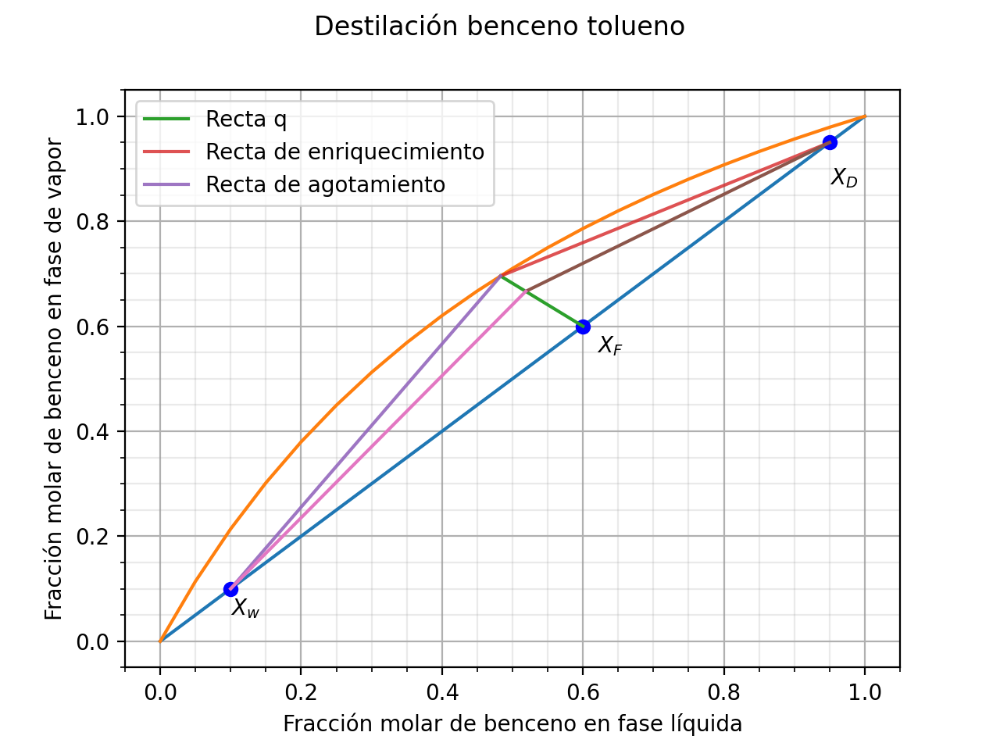

# McCabeThiele
McCabe Thiele Method for Distillation Process

## Data
`Destilacion.csv` holds benzene–toluene vapor–liquid equilibrium data (`X`, `Y`).
It is generated from a constant relative volatility model,
y = αx / (1 + (α − 1)x) with α = 2.45, not from experimental measurements.

# Author 
Bryan Piguave 
