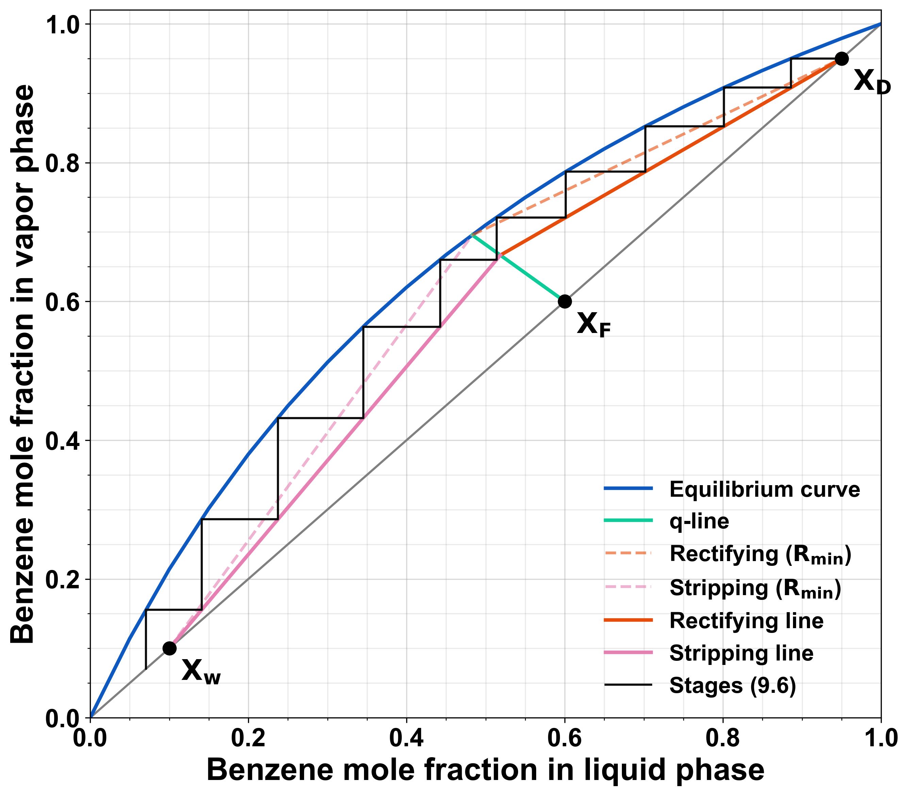

# McCabe–Thiele Distillation Design

A Python script that uses the McCabe–Thiele method to size a binary distillation
column for a **benzene–toluene** mixture. It finds the minimum reflux ratio,
steps off the theoretical stages at the operating reflux, picks the best feed
stage, and plots the diagram.



## Features

- Plots the equilibrium curve, the q-line, and the rectifying and stripping operating lines.
- Finds the **minimum reflux ratio** R_min from where the q-line meets the equilibrium curve (the pinch point).
- Steps off **theoretical stages** at R = factor × R_min and reports the fraction of the last stage.
- Picks the **optimal feed stage**: the first stage that crosses the point where the operating lines meet.
- Computes the **minimum number of stages** at total reflux.
- Works for any feed condition q, including saturated liquid (q = 1, a vertical q-line), subcooled liquid (q > 1) and superheated vapor (q < 0).

## Requirements

- Python 3.9+
- `numpy`, `pandas`, `matplotlib`, `shapely`

```bash
pip install numpy pandas matplotlib shapely
```

## Usage

Run the script from the repository root. It reads `distillation.csv` from the working directory:

```bash
python distillation.py
```

It prints the results to the console and saves the diagram as
`mccabe_thiele_benzene_toluene_theoretical_stages.{pdf,png,svg}`.

### Parameters

The design specifications are set near the top of `distillation.py`:

| Variable | Meaning | Default |
|---|---|---|
| `x_benz_feed` | Benzene mole fraction in the feed, x_F | 0.60 |
| `x_benz_dist` | Benzene mole fraction in the distillate, x_D | 0.95 |
| `x_benz_bott` | Benzene mole fraction in the bottoms, x_W | 0.10 |
| `q` | Feed thermal condition (liquid fraction of the feed) | 0.45 |
| `reflux_factor` | Operating reflux as a multiple of R_min | 1.6 |

## Data

`distillation.csv` holds benzene–toluene vapor–liquid equilibrium data in two
columns: `X` (liquid mole fraction) and `Y` (vapor mole fraction). The data comes
from a constant relative volatility model, not from experimental measurements:

$$y = \frac{\alpha x}{1 + (\alpha - 1)x}, \qquad \alpha = 2.45$$

To model another binary system, replace the CSV with that system's equilibrium
data using the same column names. Keep `X` sorted in ascending order.

## Results

With the default parameters:

| Result | Value |
|---|---|
| Minimum reflux ratio, R_min | 1.20 |
| Operating reflux ratio, R | 1.92 |
| Theoretical stages | 9.58 |
| Optimal feed stage (counted from the top) | 5 |
| Minimum stages at total reflux, N_min | 5.82 |

Stage counts include the reboiler as an equilibrium stage.

## Method

1. **q-line:** y = q/(q − 1) · x − x_F/(q − 1), drawn through (x_F, x_F).
2. **Minimum reflux:** the rectifying line through (x_D, x_D) and the pinch point
   has slope R_min / (R_min + 1).
3. **Operating lines:** the rectifying line at R = factor × R_min meets the q-line.
   The stripping line runs from that point to (x_W, x_W).
4. **Stage stepping:** starting at (x_D, x_D), the script steps horizontally to the
   equilibrium curve and vertically to the operating line until x ≤ x_W.
5. **Minimum stages:** the same stepping with the diagonal y = x as the
   operating line (total reflux).

## Author

Bryan Piguave
